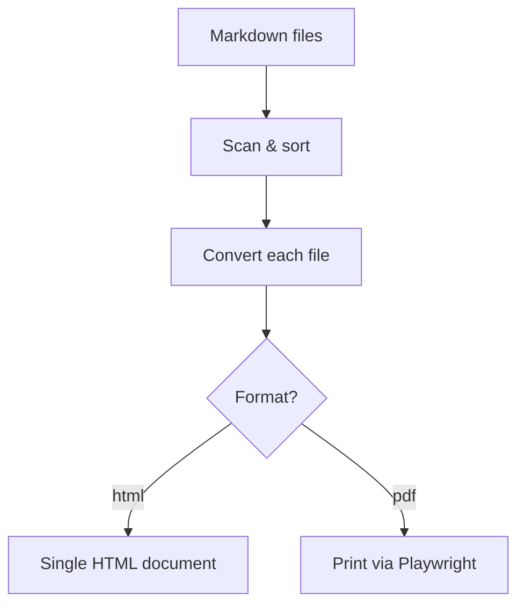
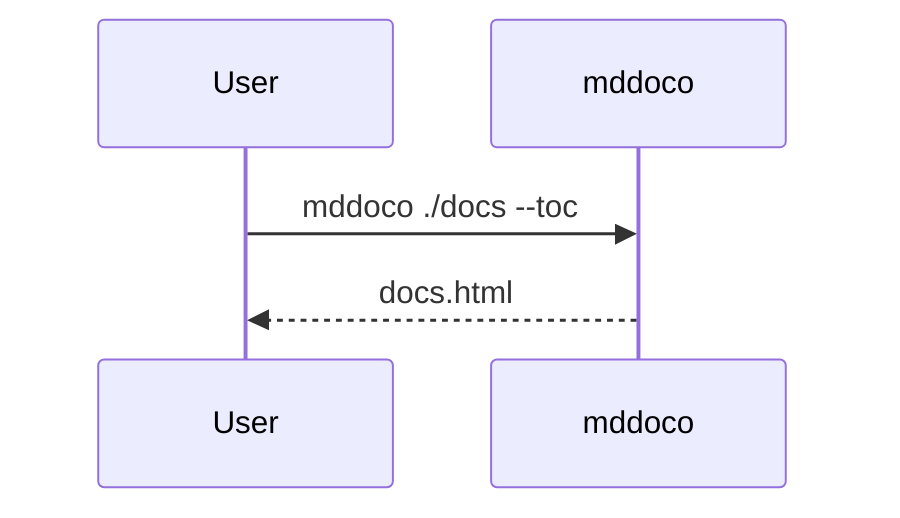

# Rich Content

Render this folder with:

```bash
mddoco examples/02_rich_content --title "Rich Content" --output ./out
```

It demonstrates the three content features that go beyond plain Markdown:
Mermaid diagrams, syntax-highlighted code, and native charts.

## Mermaid Diagrams

Fenced ` ```mermaid ` blocks are detected automatically. The Mermaid.js library
is only pulled from the CDN when a diagram is present on the page.




